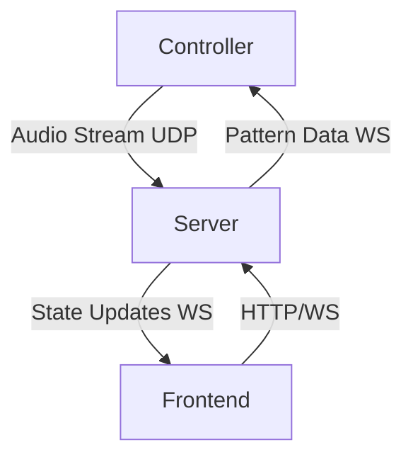

# GitLit Architecture Overview

## System Components

### 1. Server (Audio Processing & Pattern Generation)

The server is responsible for processing audio and generating LED patterns. It runs on a Linux machine (preferably with good processing power) and handles:

- Real-time audio processing using Essentia
- Pattern generation and modification
- WebSocket server for real-time updates
- REST API for control and configuration

Key Components:

- `api/`: FastAPI endpoints and WebSocket handlers
- `audio/`: Audio processing pipeline
- `patterns/`: Pattern generation engine
- `core/`: Shared utilities and state management

### 2. Controller (Raspberry Pi)

The controller runs on a Raspberry Pi connected to the LED strips. It handles:

- LED hardware control
- Audio capture and streaming
- Network communication with server
- Pattern rendering

Key Components:

- `led/`: LED strip interface
- `client/`: Audio streaming and network client
- `config/`: Hardware configuration

### 3. Frontend (Web Interface)

The frontend provides a web interface for controlling the system. It includes:

- Pattern control interface
- Audio visualization
- System monitoring
- Configuration management

## Communication Flow



1. **Audio Streaming (Controller → Server)**

   - UDP for low-latency audio streaming
   - Configurable sample rate and format
   - Buffer management for real-time processing

2. **Pattern Control (Server → Controller)**

   - WebSocket for real-time pattern updates
   - LED frame data transmission
   - State synchronization

3. **User Interface (Frontend ↔ Server)**
   - HTTP REST API for control
   - WebSocket for real-time updates
   - State management and configuration

## State Management

### Server State

- Audio processing state
- Pattern engine state
- Client connections
- System configuration

### Controller State

- LED hardware state
- Audio capture state
- Connection state
- Local configuration

### Frontend State

- UI state
- WebSocket connection
- User preferences
- Cached configurations

## Error Handling

1. **Network Resilience**

   - Automatic reconnection
   - Buffer management
   - State recovery

2. **Hardware Failures**

   - LED strip error recovery
   - Audio device management
   - Emergency shutdown

3. **State Synchronization**
   - Version checking
   - State validation
   - Conflict resolution

## Performance Considerations

1. **Audio Processing**

   - Buffer size optimization
   - Processing pipeline efficiency
   - Feature caching

2. **Pattern Generation**

   - Frame rate management
   - Memory optimization
   - GPU acceleration (where available)

3. **Network Communication**
   - Latency minimization
   - Bandwidth optimization
   - Connection pooling

## Security

1. **Network Security**

   - WebSocket authentication
   - API key management
   - CORS configuration

2. **Device Security**
   - Hardware access control
   - Configuration validation
   - Error isolation

## Development Workflow

1. **Local Development**

   ```bash
   # Start server
   cd server && source .venv/bin/activate
   uvicorn src.api.app:app --reload

   # Start controller
   cd controller && source .venv/bin/activate
   python src/client/audio_client.py

   # Start frontend
   cd frontend && npm run dev
   ```

2. **Deployment**

   ```bash
   # Deploy to Raspberry Pi
   ./tools/sync-pi.sh to_pi

   # Start services
   systemctl start gitlit-controller
   systemctl start gitlit-server
   ```

## Future Considerations

1. **Scalability**

   - Multiple LED strip support
   - Distributed audio processing
   - Pattern composition

2. **Features**

   - Advanced audio analysis
   - Machine learning integration
   - Custom pattern creation UI

3. **Integration**
   - Smart home integration
   - Mobile app support
   - External API integration
